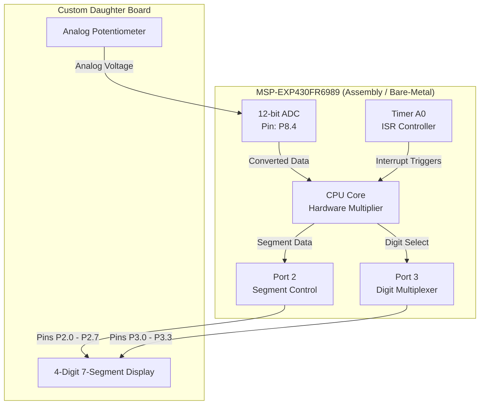

# MSP430 Interactive Hardware Multiplier

## Overview
This repository contains a bare-metal interactive hardware multiplier developed entirely in pure Assembly for the Texas Instruments MSP430FR6989. It interfaces with a custom ECE daughter board to create a complete, real-time hardware user interface. Users set hexadecimal operands (0x00 to 0xFF) via an analog potentiometer, use tactile push buttons to load the specific operands into memory, and trigger a hardware-accelerated multiplication. All current states, loaded operands, and final 16-bit products are dynamically multiplexed to a 4-digit 7-segment display.

## Key Technical Features
* **Interactive State Machine:** Manages multiple hardware states (loading Operand 1, loading Operand 2, calculating product) triggered by debounced physical push buttons (`P1.3`, `P1.5`, `P4.7`).
* **Real-Time ADC User Interface:** Configures the 12-bit ADC to continuously sample a potentiometer, providing a live, responsive input mechanism to select 8-bit values without a serial terminal.
* **Hardware Acceleration:** Leverages the MSP430's integrated hardware multiplier (`&MPY`, `&OP2`) to calculate 16-bit products instantly upon user command, bypassing slow software multiplication routines.
* **Interrupt-Driven Multiplexing:** Utilizes Timer A0 for deterministic, non-blocking execution to keep the 7-segment display perfectly multiplexed regardless of user input delays.

## Hardware Interface
The system relies on a custom daughter board mapped directly to the MSP430 GPIO pins. The physical interface is defined below:

| Component | Function | MSP430 Port |
| :--- | :--- | :--- |
| **7-Segment Display** | Segments A-G, DP | `P2.0` - `P2.7` |
| | Digit 1-4 Select | `P3.0` - `P3.3` |
| **User Inputs** | Push Button S1 | `P4.7` |
| | Push Button S2 | `P1.3` |
| | Push Button S3 | `P1.5` |
| **Analog Input** | Potentiometer Voltage | `P8.4` |
| **Status Indicators** | LED | `P3.6` |

## System Architecture



## Firmware Highlight: Hardware Multiplication & Data Parsing
To maintain deterministic performance, the firmware bypasses standard software multiplication. Instead, the ADC values are loaded directly into the MSP430's memory-mapped hardware multiplier registers (`&MPY` and `&OP2`). The resulting 16-bit product (`&RES0`) is immediately parsed into four individual hexadecimal nibbles using optimized bitwise masking and arithmetic right-shifts, preparing the data for the multiplexed 7-segment display.

```assembly
MULTIPLY:   mov            2(R13)        ,        &MPY          ; Load Operand 1 into HW Multiplier
            mov            0(R13)        ,        &OP2          ; Load Operand 2 into HW Multiplier
            mov            &RES0         ,        R4            ; Fetch 16-bit hardware-calculated product
            jmp            SEP_PROD

SEP_PROD:   mov            R4            ,        4(R13)        ; Copy product for parsing
            mov            R4            ,        6(R13)
            mov            R4            ,        8(R13)
            mov            R4            ,        10(R13)

            and            #0x000F       ,        4(R13)        ; Isolate Nibble 1 (LSB)
            and            #0x00F0       ,        6(R13)        ; Isolate Nibble 2
            and            #0x0F00       ,        8(R13)        ; Isolate Nibble 3
            and            #0xF000       ,        10(R13)       ; Isolate Nibble 4 (MSB)

            ;--------- Shift Nibbles to LSB for Display Routing --------
            mov            #0x04         ,        R14
loop1:      rra            6(R13)
            dec            R14
            jnz            loop1
```

## Development & Debugging Tools
* **IDE:** Texas Instruments Code Composer Studio (CCS)
* **Debugging Interface:** TI Spy-Bi-Wire (2-wire JTAG). Used for halting the CPU core, stepping through assembly instruction cycles, and performing real-time register inspections to ensure exact timing alignments across the hardware timer interrupts.
